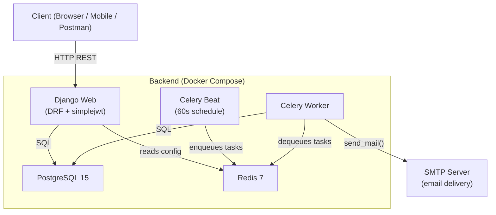
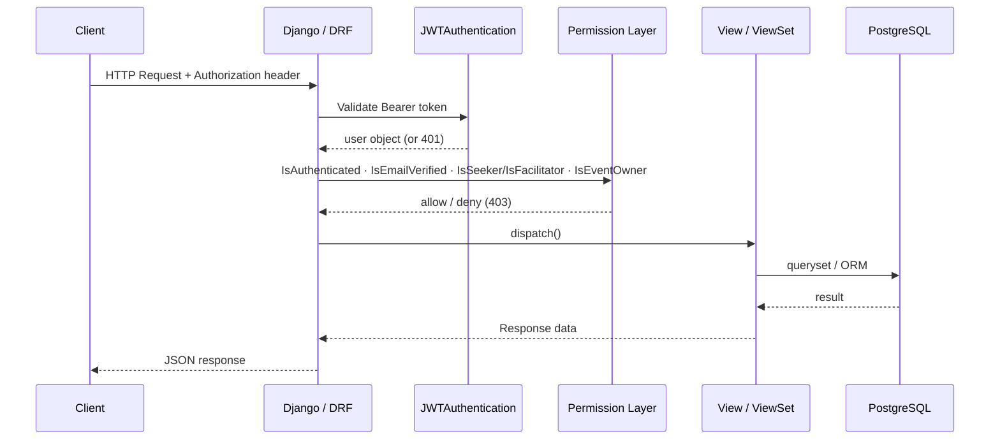
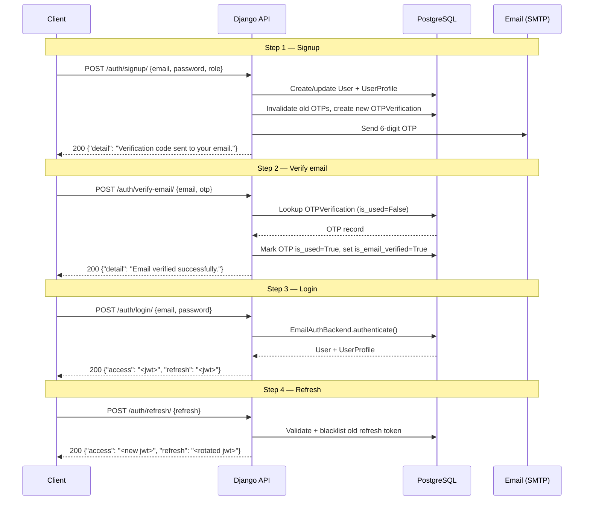
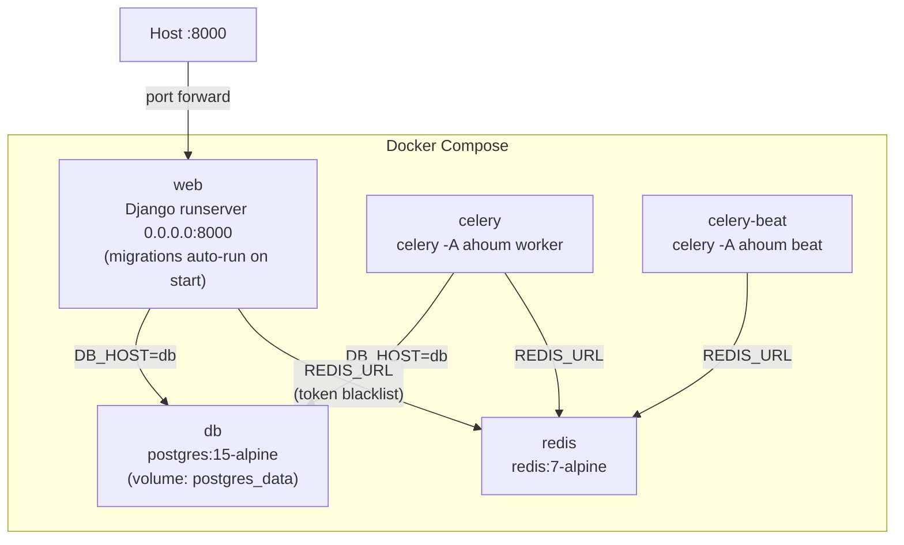

# High Level Design — Ahoum Events Platform

---

## 1. Problem Statement

Ahoum is an event management platform with two user roles: **facilitators** who create and run events, and **seekers** who discover and enroll in them. The backend must:

- Authenticate users securely using email and a one-time password before granting access
- Enforce strict role separation so seekers cannot create events and facilitators cannot enroll
- Prevent race conditions when multiple seekers attempt to enroll in a near-full event simultaneously
- Notify enrolled seekers automatically without blocking the request cycle

---

## 2. Functional Requirements

### Authentication

| # | Requirement |
|---|---|
| F-A1 | Users register with email, password, and role (`seeker` or `facilitator`) |
| F-A2 | A 6-digit OTP is sent to the registered email; the account is not usable until verified |
| F-A3 | Re-registration with an unverified email resends a fresh OTP and invalidates the previous one |
| F-A4 | Login requires a verified email; returns a JWT access token and a refresh token |
| F-A5 | Refresh tokens rotate on every use and are blacklisted after rotation |

### RBAC

| # | Requirement |
|---|---|
| F-R1 | Every protected endpoint checks that the request user's email is verified |
| F-R2 | Event creation and management are restricted to the `facilitator` role |
| F-R3 | Event browsing, retrieval, and enrollment are restricted to the `seeker` role |
| F-R4 | Update and delete on an event are further restricted to the event's creator |

### Events

| # | Requirement |
|---|---|
| F-E1 | Facilitators create events with title, description, language, location, start/end times, and optional capacity |
| F-E2 | `starts_at` must be in the future and strictly before `ends_at` on creation |
| F-E3 | Facilitators can fully or partially update their own events |
| F-E4 | Facilitators can delete their own events only if no active enrollments exist |
| F-E5 | `GET /events/my/` returns the facilitator's own events annotated with active enrollment count and available seats |

### Enrollments

| # | Requirement |
|---|---|
| F-N1 | Seekers enroll in a single future event; duplicate active enrollments are rejected |
| F-N2 | If the event has a capacity, enrollment is rejected when the event is full |
| F-N3 | Seekers cancel their active enrollment; a cancellation does not prevent re-enrollment |
| F-N4 | `GET /enrollments/upcoming/` returns active enrollments in events that have not yet ended |
| F-N5 | `GET /enrollments/past/` returns active enrollments in events that have ended |

### Search

| # | Requirement |
|---|---|
| F-S1 | Seekers filter events by `location` (substring), `language` (exact), and date range |
| F-S2 | Free-text `q` parameter searches across event `title` and `description` |
| F-S3 | Results are orderable by `starts_at` or `title` |
| F-S4 | All list responses are paginated (default 10, max 100) |

### Notifications

| # | Requirement |
|---|---|
| F-M1 | A follow-up email is sent to a seeker approximately 1 hour after enrollment |
| F-M2 | A reminder email is sent to a seeker approximately 1 hour before their event starts |

---

## 3. Non-Functional Requirements

### Security

| Requirement | Implementation |
|---|---|
| Credentials never stored in plain text | Django's PBKDF2 password hashing |
| Short-lived session tokens | Access token lifetime: 15 minutes |
| Token theft mitigation | Refresh token rotation + blacklisting via `simplejwt.token_blacklist` |
| OTP brute-force mitigation | 5-attempt limit (429 on exhaustion); 5-minute expiry |
| No username enumeration | `EmailAuthBackend` returns `None` (not an error) for unknown emails |

### Scalability

| Requirement | Implementation |
|---|---|
| Stateless API | JWT; no server-side session storage |
| Background email delivery | Celery workers are horizontally scalable |
| Broker decoupling | Redis as the Celery broker; replaceable with RabbitMQ |
| DB query efficiency | Indexed columns on `language`, `location`, `starts_at`; `select_related` on hot paths |

### Maintainability

| Requirement | Implementation |
|---|---|
| Consistent error contract | All errors normalised to `{"detail", "code"}` by a single exception handler |
| Settings split by environment | `base.py` / `local.py` / `production.py` with `python-decouple` |
| Role permissions in one place | `core/permissions.py` defines all role and verification checks |
| Domain exceptions decoupled from views | `accounts/exceptions.py` and `accounts/services.py` hold OTP business logic |

### Performance

| Requirement | Implementation |
|---|---|
| Concurrency-safe enrollment | `SELECT FOR UPDATE` inside `transaction.atomic()` |
| Minimal write contention | `save(update_fields=[...])` for targeted field updates |
| Annotated queries over N+1 | `Count` annotation on `my_events` queryset instead of per-event queries |

---

## 4. System Architecture

### Component Diagram

### Request Flow Diagram

### Authentication Flow Diagram

---

## 5. Database Overview

### User *(Django built-in `auth_user`)*

Stores credentials. The `username` field is set to a 32-character UUID hex at signup and is never exposed externally. All authentication and API identity uses `email`.

### UserProfile

| Column | Type | Notes |
|---|---|---|
| `user` | OneToOne FK → `auth_user` | CASCADE on delete |
| `role` | CharField | `seeker` or `facilitator` |
| `is_email_verified` | BooleanField | Default `False`; set `True` after OTP verification |

Created automatically by a `post_save` signal on `User`. The signup serializer immediately overwrites the default `seeker` role with the user-supplied value.

### OTPVerification

| Column | Type | Notes |
|---|---|---|
| `user` | FK → `auth_user` | CASCADE on delete |
| `otp` | CharField(6) | Cryptographically random (secrets module) |
| `expires_at` | DateTimeField | `now + OTP_EXPIRY_MINUTES` |
| `attempts` | PositiveSmallIntegerField | Incremented on each wrong guess |
| `max_attempts` | PositiveSmallIntegerField | Snapshotted from `settings.OTP_MAX_ATTEMPTS` at creation |
| `is_used` | BooleanField | Set `True` on successful verification or re-signup |
| `created_at` | DateTimeField | Auto |

Ordered by `-created_at`. Verification always uses the most recent non-used OTP.

### Event

| Column | Type | Index | Notes |
|---|---|---|---|
| `title` | CharField(255) | — | — |
| `description` | TextField | — | — |
| `language` | CharField(100) | `db_index=True` | Used in filter |
| `location` | CharField(255) | `db_index=True` | Used in filter |
| `starts_at` | DateTimeField | `db_index=True` | Used in ordering and date-range filter |
| `ends_at` | DateTimeField | — | Used to determine if event is past |
| `capacity` | PositiveIntegerField | — | `NULL` = unlimited |
| `created_by` | FK → `auth_user` | — | `PROTECT` — cannot delete a user who owns events |
| `created_at` | DateTimeField | — | Auto |
| `updated_at` | DateTimeField | — | Auto |

Default ordering: `starts_at` ascending.

### Enrollment

| Column | Type | Notes |
|---|---|---|
| `event` | FK → `Event` | CASCADE on delete |
| `seeker` | FK → `auth_user` | CASCADE on delete |
| `status` | CharField(20) | `enrolled` or `canceled` |
| `created_at` | DateTimeField | Auto |
| `updated_at` | DateTimeField | Auto |

**Partial unique constraint:** `UNIQUE (event, seeker) WHERE status = 'enrolled'`
Allows a seeker to cancel and re-enroll without violating the constraint. Requires PostgreSQL.

Default ordering: `-created_at`.

---

## 6. Background Jobs

Both tasks are registered in `CELERY_BEAT_SCHEDULE` and run every **60 seconds**.

### Follow-up Email (`send_enrollment_followup`)

Triggered approximately 1 hour after a seeker enrolls. The task queries all `Enrollment` rows with `status=enrolled` and `created_at` within the window `[now − 61 min, now − 59 min]`. For each match, it sends an email confirming the enrollment with event title, start time, and location.

The ±1-minute window compensates for scheduler drift. `fail_silently=True` prevents a transient SMTP failure from crashing the worker.

### Reminder Email (`send_event_reminder`)

Triggered approximately 1 hour before an event's start time. Queries `Enrollment` rows with `status=enrolled` and `event__starts_at` within `[now + 59 min, now + 61 min]`. Sends a reminder email to each enrolled seeker.

---

## 7. Deployment Architecture

| Service | Image / Command | Depends On |
|---|---|---|
| `db` | `postgres:15-alpine` | — |
| `redis` | `redis:7-alpine` | — |
| `web` | App image; `migrate && runserver 0.0.0.0:8000` | `db`, `redis` (healthy) |
| `celery` | App image; `celery -A ahoum worker` | `db`, `redis` (healthy) |
| `celery-beat` | App image; `celery -A ahoum beat` | `db`, `redis` (healthy) |

All application services share `.env` and override `DB_HOST=db` and `REDIS_URL=redis://redis:6379/0` to use Docker network service names.
