# Low Level Design — Ahoum Events Platform

---

## 1. Module Breakdown

### `apps/core`

Provides cross-cutting infrastructure shared by all other apps.

| File | Responsibility |
|---|---|
| `exceptions.py` | `custom_exception_handler` — normalises all DRF error shapes into `{"detail", "code"}` |
| `pagination.py` | `StandardResultsPagination` — page-number pagination, default 10 per page, max 100 |
| `permissions.py` | `IsEmailVerified`, `IsSeeker`, `IsFacilitator` — reusable DRF permission classes |
| `utils.py` | `generate_otp()` — cryptographically secure 6-digit string; `aware_utcnow()` — timezone-aware UTC now |

### `apps/accounts`

Owns the full authentication and user lifecycle.

| File | Responsibility |
|---|---|
| `models.py` | `UserProfile` (role, verification flag), `OTPVerification` (OTP value, expiry, attempts) |
| `backends.py` | `EmailAuthBackend` — `authenticate(email, password)` override |
| `signals.py` | `post_save` on `User` → auto-create `UserProfile` with default role |
| `exceptions.py` | `OTPNotFoundException`, `OTPExpiredException`, `OTPExhaustedException`, `OTPInvalidException` |
| `services.py` | `generate_and_send_otp()`, `verify_otp()` — all OTP business logic isolated here |
| `serializers.py` | `SignupSerializer`, `OTPVerifySerializer`, `LoginSerializer` |
| `views.py` | `SignupAPIView`, `VerifyEmailAPIView`, `LoginAPIView` (all `APIView` subclasses) |
| `urls.py` | Routes under `/auth/` prefix |

### `apps/events`

Owns events, enrollments, filters, and background tasks.

| File | Responsibility |
|---|---|
| `models.py` | `Event`, `Enrollment` |
| `permissions.py` | `IsEventOwner` — object-level permission |
| `filters.py` | `EventFilter` — `django-filter` `FilterSet` |
| `serializers.py` | `EventSerializer`, `EventWithCountsSerializer`, `EnrollmentDetailSerializer` |
| `views.py` | `EventViewSet` (ModelViewSet), `UpcomingEnrollmentsView`, `PastEnrollmentsView` |
| `tasks.py` | `send_enrollment_followup`, `send_event_reminder` — Celery shared tasks |
| `urls.py` | DefaultRouter for `EventViewSet`; manual paths for enrollment list views |

---

## 2. Detailed Model Design

### `UserProfile`

| Field | Type | Constraints | Notes |
|---|---|---|---|
| `id` | BigAutoField | PK | — |
| `user` | OneToOneField → `auth_user` | CASCADE, `related_name="userprofile"` | 1:1 with Django User |
| `role` | CharField(20) | choices: `seeker`, `facilitator`; default `seeker` | Overwritten immediately by `SignupSerializer` |
| `is_email_verified` | BooleanField | default `False` | Set `True` by `verify_otp()` |

**Relationships:** `user.userprofile` (reverse accessor)
**Indexes:** None (primary key only); accessed exclusively via `user` FK

---

### `OTPVerification`

| Field | Type | Constraints | Notes |
|---|---|---|---|
| `id` | BigAutoField | PK | — |
| `user` | ForeignKey → `auth_user` | CASCADE, `related_name="otp_verifications"` | One user can have multiple OTP rows |
| `otp` | CharField(6) | — | Plain-text 6-digit string |
| `expires_at` | DateTimeField | — | `now + settings.OTP_EXPIRY_MINUTES` |
| `attempts` | PositiveSmallIntegerField | default `0` | Incremented per wrong guess |
| `max_attempts` | PositiveSmallIntegerField | default `5` | Snapshotted at creation |
| `is_used` | BooleanField | default `False` | Set `True` on success or re-signup |
| `created_at` | DateTimeField | auto_now_add | — |

**Meta:** `ordering = ["-created_at"]` — `.first()` on a filtered queryset always returns the newest OTP
**Properties:** `is_expired` (`now >= expires_at`), `is_exhausted` (`attempts >= max_attempts`)

---

### `Event`

| Field | Type | Constraints | Notes |
|---|---|---|---|
| `id` | BigAutoField | PK | — |
| `title` | CharField(255) | — | — |
| `description` | TextField | — | — |
| `language` | CharField(100) | `db_index=True` | Filtered with `iexact` |
| `location` | CharField(255) | `db_index=True` | Filtered with `icontains` |
| `starts_at` | DateTimeField | `db_index=True` | Filtered/ordered; must be future on create |
| `ends_at` | DateTimeField | — | Must be > `starts_at` |
| `capacity` | PositiveIntegerField | nullable | `NULL` = unlimited |
| `created_by` | ForeignKey → `auth_user` | PROTECT, `related_name="events"` | PROTECT prevents orphaning |
| `created_at` | DateTimeField | auto_now_add | — |
| `updated_at` | DateTimeField | auto_now | — |

**Meta:** `ordering = ["starts_at"]`
**Indexes:** `language`, `location`, `starts_at` (all `db_index=True`)

---

### `Enrollment`

| Field | Type | Constraints | Notes |
|---|---|---|---|
| `id` | BigAutoField | PK | — |
| `event` | ForeignKey → `Event` | CASCADE, `related_name="enrollments"` | — |
| `seeker` | ForeignKey → `auth_user` | CASCADE, `related_name="enrollments"` | — |
| `status` | CharField(20) | choices: `enrolled`, `canceled`; default `enrolled` | Soft-delete pattern |
| `created_at` | DateTimeField | auto_now_add | — |
| `updated_at` | DateTimeField | auto_now | — |

**Meta:** `ordering = ["-created_at"]`
**Constraints:**
```python
UniqueConstraint(
    fields=["event", "seeker"],
    condition=Q(status="enrolled"),
    name="unique_active_enrollment",
)
```
This partial unique constraint (PostgreSQL) allows a seeker to cancel and re-enroll; only one active (`enrolled`) row per `(event, seeker)` pair is permitted.

---

## 3. API Design

### POST `/auth/signup/`

| Attribute | Value |
|---|---|
| **Auth** | None (`AllowAny`) |
| **View** | `SignupAPIView` |

**Request body:**
```json
{ "email": "user@example.com", "password": "SecurePass123!", "role": "seeker" }
```

**Response — 200 OK:**
```json
{ "detail": "Verification code sent to your email." }
```

**Validation rules:**
- `email`: normalised to lowercase; rejected if a verified account with this email already exists (`code: email_already_exists`)
- `password`: must pass Django's built-in validators (min 8 chars, not numeric-only, not common)
- `role`: must be exactly `seeker` or `facilitator` (case-insensitive); otherwise `code: invalid_role`

**Errors:**

| HTTP | `code` | Condition |
|---|---|---|
| 400 | `email_already_exists` | Verified account for this email exists |
| 400 | `invalid_role` | Role not in `[seeker, facilitator]` |
| 400 | `password_too_short` / `password_too_common` | Django password validators fail |

---

### POST `/auth/verify-email/`

| Attribute | Value |
|---|---|
| **Auth** | None (`AllowAny`) |
| **View** | `VerifyEmailAPIView` |

**Request body:**
```json
{ "email": "user@example.com", "otp": "123456" }
```

**Response — 200 OK:**
```json
{ "detail": "Email verified successfully." }
```

**Validation rules:**
- `otp`: must be exactly 6 ASCII digits; non-digit input rejected immediately (`code: otp_invalid`)
- Checks applied in order: OTP exists → not expired → not exhausted → value matches

**Errors:**

| HTTP | `code` | Condition |
|---|---|---|
| 400 | `otp_invalid` | Non-digit input, or wrong OTP value |
| 400 | `otp_expired` | OTP's `expires_at` is in the past |
| 400 | `otp_not_found` | No active (non-used) OTP for this email |
| 429 | `otp_max_attempts` | `attempts >= max_attempts` |

---

### POST `/auth/login/`

| Attribute | Value |
|---|---|
| **Auth** | None (`AllowAny`) |
| **View** | `LoginAPIView` |

**Request body:**
```json
{ "email": "user@example.com", "password": "SecurePass123!" }
```

**Response — 200 OK:**
```json
{ "access": "<jwt_access_token>", "refresh": "<jwt_refresh_token>" }
```

**Errors:**

| HTTP | `code` | Condition |
|---|---|---|
| 401 | `invalid_credentials` | Email not found or password incorrect |
| 403 | `email_not_verified` | Credentials valid but email not yet verified |

---

### POST `/auth/refresh/`

| Attribute | Value |
|---|---|
| **Auth** | None (`AllowAny`) |
| **View** | `rest_framework_simplejwt.views.TokenRefreshView` |

**Request body:**
```json
{ "refresh": "<refresh_token>" }
```

**Response — 200 OK:**
```json
{ "access": "<new_access_token>", "refresh": "<rotated_refresh_token>" }
```

**Errors:**

| HTTP | `code` | Condition |
|---|---|---|
| 400 | `token_not_valid` | `refresh` field missing |
| 401 | `token_not_valid` | Token invalid, expired, or already blacklisted |

---

### POST `/events/`

| Attribute | Value |
|---|---|
| **Auth** | JWT Bearer |
| **Permissions** | `IsAuthenticated`, `IsEmailVerified`, `IsFacilitator` |
| **View** | `EventViewSet.create` |

**Request body:**
```json
{
  "title": "Intro to Mindfulness",
  "description": "A beginner-friendly session.",
  "language": "English",
  "location": "New Delhi",
  "starts_at": "2026-08-01T10:00:00Z",
  "ends_at": "2026-08-01T13:00:00Z",
  "capacity": 30
}
```
`capacity` is optional; omit for unlimited.

**Response — 201 Created:** Full `EventSerializer` output (all fields including read-only `id`, `created_by`, `created_at`, `updated_at`).

**Validation rules:**
- `starts_at` must be in the future on create (`code: event_in_past`)
- `starts_at` must be strictly before `ends_at` (`code: invalid_dates`)

---

### GET `/events/`

| Attribute | Value |
|---|---|
| **Auth** | JWT Bearer |
| **Permissions** | `IsAuthenticated`, `IsEmailVerified`, `IsSeeker` |
| **View** | `EventViewSet.list` |

**Queryset:** Events where `ends_at > now()` (future and in-progress events only).

**Query parameters:**

| Parameter | Filter type | Field |
|---|---|---|
| `location` | `icontains` | `location` |
| `language` | `iexact` | `language` |
| `starts_after` | `gte` | `starts_at` |
| `starts_before` | `lte` | `starts_at` |
| `q` | `title__icontains` OR `description__icontains` | — |
| `ordering` | `OrderingFilter` | `starts_at`, `title` |
| `page` | pagination | — |
| `page_size` | pagination (max 100) | — |

**Response — 200 OK:**
```json
{
  "count": 1, "next": null, "previous": null,
  "results": [{ "id": 1, "title": "...", ... }]
}
```

---

### GET `/events/{id}/`

| Attribute | Value |
|---|---|
| **Auth** | JWT Bearer |
| **Permissions** | `IsAuthenticated`, `IsEmailVerified` |
| **View** | `EventViewSet.retrieve` |

**Queryset:** All events (no `ends_at` filter).

**Response — 200 OK:** `EventSerializer` for the matching event.
**Error — 404:** `{"detail": "No Event matches the given query.", "code": "not_found"}`

---

### PATCH `/events/{id}/`

| Attribute | Value |
|---|---|
| **Auth** | JWT Bearer |
| **Permissions** | `IsAuthenticated`, `IsEmailVerified`, `IsFacilitator`, `IsEventOwner` |
| **View** | `EventViewSet.partial_update` |

**Request body:** Any subset of writable event fields.

**Response — 200 OK:** Full updated `EventSerializer` output.

**Errors:**

| HTTP | `code` | Condition |
|---|---|---|
| 400 | `invalid_dates` | Updated times result in `starts_at >= ends_at` |
| 403 | `not_owner` | Authenticated facilitator does not own this event |

---

### PUT `/events/{id}/`

| Attribute | Value |
|---|---|
| **Auth** | JWT Bearer |
| **Permissions** | `IsAuthenticated`, `IsEmailVerified`, `IsFacilitator`, `IsEventOwner` |
| **View** | `EventViewSet.update` |

**Request body:** All writable fields required (full replacement).

**Response — 200 OK:** Full updated `EventSerializer` output.

---

### DELETE `/events/{id}/`

| Attribute | Value |
|---|---|
| **Auth** | JWT Bearer |
| **Permissions** | `IsAuthenticated`, `IsEmailVerified`, `IsFacilitator`, `IsEventOwner` |
| **View** | `EventViewSet.destroy` |

**Response — 204 No Content:** Empty body.

**Errors:**

| HTTP | `code` | Condition |
|---|---|---|
| 400 | `event_has_active_enrollments` | One or more `enrolled` enrollments exist for this event |
| 403 | `not_owner` | Authenticated facilitator does not own this event |

---

### GET `/events/my/`

| Attribute | Value |
|---|---|
| **Auth** | JWT Bearer |
| **Permissions** | `IsAuthenticated`, `IsEmailVerified`, `IsFacilitator` |
| **View** | `EventViewSet.my_events` (custom `@action`) |
| **Serializer** | `EventWithCountsSerializer` |

**Queryset:** `Event.objects.filter(created_by=request.user).annotate(total_enrollments=Count("enrollments", filter=Q(enrollments__status="enrolled")))`

**Response — 200 OK:** Paginated list. Each event includes extra fields:

| Field | Type | Description |
|---|---|---|
| `total_enrollments` | integer | Count of active (`enrolled`) enrollments |
| `available_seats` | integer or null | `capacity - total_enrollments`; `null` if capacity is unlimited |

---

### POST `/events/{id}/enroll/`

| Attribute | Value |
|---|---|
| **Auth** | JWT Bearer |
| **Permissions** | `IsAuthenticated`, `IsEmailVerified`, `IsSeeker` |
| **View** | `EventViewSet.enroll` (custom `@action`) |

**Request body:** None.

**Response — 201 Created:**
```json
{ "detail": "Successfully enrolled in the event." }
```

**Errors:**

| HTTP | `code` | Condition |
|---|---|---|
| 400 | `event_already_ended` | `event.ends_at <= now()` |
| 400 | `already_enrolled` | Active enrollment already exists |
| 400 | `event_full` | `active_count >= event.capacity` (capacity is not null) |

---

### DELETE `/events/{id}/enroll/`

| Attribute | Value |
|---|---|
| **Auth** | JWT Bearer |
| **Permissions** | `IsAuthenticated`, `IsEmailVerified`, `IsSeeker` |
| **View** | `EventViewSet.enroll` (custom `@action`, method `DELETE`) |

**Request body:** None.

**Response — 200 OK:**
```json
{ "detail": "Enrollment canceled successfully." }
```

**Errors:**

| HTTP | `code` | Condition |
|---|---|---|
| 404 | `not_found` | No active (`enrolled`) enrollment found for `(event, seeker)` |

---

### GET `/enrollments/upcoming/`

| Attribute | Value |
|---|---|
| **Auth** | JWT Bearer |
| **Permissions** | `IsAuthenticated`, `IsEmailVerified`, `IsSeeker` |
| **View** | `UpcomingEnrollmentsView` (ListAPIView) |
| **Serializer** | `EnrollmentDetailSerializer` |

**Queryset:** `Enrollment.objects.filter(seeker=request.user, status="enrolled", event__ends_at__gt=now())` — ordered by `event__starts_at` ascending.

**Response — 200 OK:** Paginated list; each result nests the full `EventSerializer` under `event`.

---

### GET `/enrollments/past/`

| Attribute | Value |
|---|---|
| **Auth** | JWT Bearer |
| **Permissions** | `IsAuthenticated`, `IsEmailVerified`, `IsSeeker` |
| **View** | `PastEnrollmentsView` (ListAPIView) |
| **Serializer** | `EnrollmentDetailSerializer` |

**Queryset:** `Enrollment.objects.filter(seeker=request.user, status="enrolled", event__ends_at__lte=now())` — ordered by `event__starts_at` descending.

---

## 4. Authentication Design

### Signup (`SignupSerializer.create`)

```
1. Normalise email to lowercase
2. Check for existing verified account → raise if found
3. Inside transaction.atomic():
   a. If unverified User exists → update password + role
   b. Else → create User with username=uuid4().hex
   c. Update UserProfile.role (post_save signal already created the profile)
   d. Call generate_and_send_otp(user) inside the transaction
      → if send_mail fails, the entire transaction rolls back cleanly
```

`fail_silently=False` is intentional for OTP mail — a send failure rolls back the transaction rather than leaving a user stuck with a silent failure.

### OTP Verification (`verify_otp` service)

```
1. Lookup User by email → OTPNotFoundException if not found
2. Get newest active OTPVerification (is_used=False, ordered -created_at)
3. Check is_expired → OTPExpiredException
4. Check is_exhausted → OTPExhaustedException
5. Compare OTP value:
   - Mismatch → increment attempts, save(update_fields=["attempts"]), raise OTPInvalidException
   - Match → set is_used=True, save; set UserProfile.is_email_verified=True (UPDATE, not save())
6. Return verified User
```

Checks are ordered to avoid leaking information: expired and exhausted errors do not reveal whether the OTP value was correct.

### Login (`LoginSerializer`)

```
1. Call authenticate(email=..., password=...) via EmailAuthBackend
2. If None → AuthenticationFailed (401, code: invalid_credentials)
3. Check user.userprofile.is_email_verified
4. If False → PermissionDenied (403, code: email_not_verified)
5. Generate RefreshToken.for_user(user) via simplejwt
6. Return {"access": str(refresh.access_token), "refresh": str(refresh)}
```

`AuthenticationFailed` and `PermissionDenied` are raised from within `validate()` rather than `ValidationError` to produce correct HTTP 401 / 403 status codes.

### JWT Refresh

Handled entirely by `rest_framework_simplejwt.views.TokenRefreshView`.

| Setting | Value |
|---|---|
| `ACCESS_TOKEN_LIFETIME` | 15 minutes |
| `REFRESH_TOKEN_LIFETIME` | 7 days |
| `ROTATE_REFRESH_TOKENS` | `True` — new refresh token issued on every refresh |
| `BLACKLIST_AFTER_ROTATION` | `True` — old refresh token written to `token_blacklist` table |
| `AUTH_HEADER_TYPES` | `("Bearer",)` |

---

## 5. Enrollment Logic

### Full flow (`EventViewSet._handle_enroll`)

```python
with transaction.atomic():
    locked = Event.objects.select_for_update().get(pk=event.pk)  # row-level lock

    if aware_utcnow() >= locked.ends_at:
        raise ValidationError(code="event_already_ended")

    already_enrolled = Enrollment.objects.filter(
        event=locked, seeker=seeker, status=STATUS_ENROLLED
    ).exists()
    if already_enrolled:
        raise ValidationError(code="already_enrolled")

    if locked.capacity is not None:
        active_count = Enrollment.objects.filter(
            event=locked, status=STATUS_ENROLLED
        ).count()
        if active_count >= locked.capacity:
            raise ValidationError(code="event_full")

    Enrollment.objects.create(event=locked, seeker=seeker)
```

### Capacity checks

Capacity is only checked when `event.capacity is not None`. A `NULL` capacity means unlimited enrollment.

### Duplicate prevention

The ORM-level check (`Enrollment.objects.filter(..., status=STATUS_ENROLLED).exists()`) is the primary guard. The DB-level partial unique constraint `unique_active_enrollment` is a safety net for any path that bypasses the ORM check.

### Transaction handling

The entire enrollment flow runs inside `transaction.atomic()`. Any exception raised after `select_for_update()` causes the transaction to roll back automatically, releasing the lock.

### `select_for_update` usage

`Event.objects.select_for_update().get(pk=event.pk)` acquires a row-level `FOR UPDATE` lock on the specific event row. Concurrent requests attempting to enroll in the same event are serialised at this point: the second request blocks until the first commits or rolls back, then re-reads the current capacity count. This eliminates the TOCTOU race condition.

### Cancellation (`EventViewSet._handle_cancel`)

```python
enrollment = Enrollment.objects.get(event=event, seeker=seeker, status=STATUS_ENROLLED)
enrollment.status = STATUS_CANCELED
enrollment.save(update_fields=["status", "updated_at"])
```

No `select_for_update` needed here because cancellation is not capacity-sensitive; a lost update to `status` is not possible since only the enrollment owner can cancel.

---

## 6. Search Design

### Filters (`EventFilter`)

Implemented as a `django-filter` `FilterSet` on `EventViewSet`.

| Parameter | Lookup | Field |
|---|---|---|
| `location` | `icontains` | `Event.location` |
| `language` | `iexact` | `Event.language` |
| `starts_after` | `gte` | `Event.starts_at` |
| `starts_before` | `lte` | `Event.starts_at` |
| `q` | custom method | `title__icontains OR description__icontains` |

The `q` filter uses `Q(title__icontains=value) | Q(description__icontains=value)` — a single OR query rather than two separate filters.

### Ordering

`EventViewSet` uses `rest_framework.filters.OrderingFilter`.

| `ordering` value | SQL |
|---|---|
| `starts_at` (default) | `ORDER BY starts_at ASC` |
| `-starts_at` | `ORDER BY starts_at DESC` |
| `title` | `ORDER BY title ASC` |
| `-title` | `ORDER BY title DESC` |

The model's `Meta.ordering = ["starts_at"]` provides the default when no `ordering` parameter is given.

### Pagination

`StandardResultsPagination` (in `core/pagination.py`) is applied globally via `DEFAULT_PAGINATION_CLASS`.

| Setting | Value |
|---|---|
| `page_size` | `10` |
| `page_size_query_param` | `page_size` |
| `max_page_size` | `100` |

Response envelope:
```json
{ "count": <total>, "next": <url|null>, "previous": <url|null>, "results": [...] }
```

---

## 7. Error Handling

### Custom Exception Handler (`core/exceptions.py`)

Registered as `EXCEPTION_HANDLER` in `REST_FRAMEWORK` settings. Called for every exception that DRF would normally handle.

DRF produces three possible `response.data` shapes:

| Shape | Example |
|---|---|
| Dict with `detail` | `{"detail": ErrorDetail("Not found.", code="not_found")}` |
| Field-error dict | `{"email": [ErrorDetail("Already exists.", code="email_already_exists")]}` |
| List | `[ErrorDetail("Invalid.", code="invalid")]` |

The handler normalises all three to:
```json
{ "detail": "<human-readable string>", "code": "<machine-readable code>" }
```

For field-error dicts, the first error of the first field is used. This keeps the contract simple for API consumers.

### Domain Exception Classes (`accounts/exceptions.py`)

All OTP-related errors are `APIException` subclasses, making them safe to raise from service functions without wrapping in a try/except in the view.

| Class | HTTP | `code` |
|---|---|---|
| `OTPNotFoundException` | 400 | `otp_not_found` |
| `OTPExpiredException` | 400 | `otp_expired` |
| `OTPExhaustedException` | 429 | `otp_max_attempts` |
| `OTPInvalidException` | 400 | `otp_invalid` |

### Error Response Format

Every error response from the API has this exact shape:
```json
{ "detail": "Human-readable message.", "code": "machine_readable_code" }
```

Permission classes declare a `code` attribute (`code = "not_owner"`, `code = "permission_denied"`) which DRF forwards into `PermissionDenied(code=...)`, flowing through the exception handler automatically.

---

## 8. Background Task Design

Both tasks are `@shared_task` functions in `apps/events/tasks.py`, registered via `CELERY_BEAT_SCHEDULE` in `base.py`.

### Celery Configuration

| Setting | Value |
|---|---|
| `CELERY_BROKER_URL` | `REDIS_URL` |
| `CELERY_RESULT_BACKEND` | `REDIS_URL` |
| `CELERY_BEAT_SCHEDULER` | `django_celery_beat.schedulers:DatabaseScheduler` |
| Schedule interval | 60 seconds for both tasks |

### `send_enrollment_followup`

**Trigger condition:** Enrollment `created_at` falls within `[now − 61 min, now − 59 min]`

```
Celery Beat (every 60s)
  → enqueues send_enrollment_followup
  → Celery Worker dequeues
  → Query: Enrollment WHERE status=enrolled AND created_at IN [now-61m, now-59m]
  → For each row: send_mail(to=seeker.email, subject="You're enrolled in {event.title}")
  → fail_silently=True (SMTP failure does not crash worker)
```

**Email content:** Event title, start datetime (UTC), location.

### `send_event_reminder`

**Trigger condition:** `event.starts_at` falls within `[now + 59 min, now + 61 min]`

```
Celery Beat (every 60s)
  → enqueues send_event_reminder
  → Celery Worker dequeues
  → Query: Enrollment WHERE status=enrolled AND event__starts_at IN [now+59m, now+61m]
  → For each row: send_mail(to=seeker.email, subject="Reminder: {event.title} starts in 1 hour")
  → fail_silently=True
```

**Email content:** Event title, start datetime (UTC), location.

### Jitter Window Rationale

Both tasks use a ±1-minute window rather than an exact match to account for the fact that the Beat scheduler does not fire at microsecond precision. A 60-second schedule may slip by a few seconds over time. The window ensures no enrollment or event is missed due to drift, at the cost of a theoretical duplicate send if Beat fires twice within the window (e.g., after a restart).

```mermaid
gantt
    title Follow-up email trigger window
    dateFormat  HH:mm
    axisFormat  %H:%M

    section Enrollment created at 10:00
    Enrollment created       : milestone, 10:00, 0m
    Beat fires at ~11:00     : milestone, 11:00, 0m
    Detection window         : active, 10:59, 2m
```


